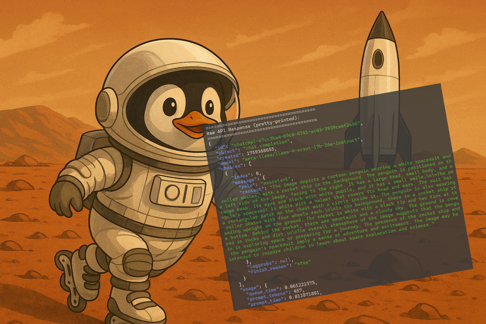

# AI 101: Learn AI APIs the Safe Way

**A hands-on learning path from basic AI to responsible AI development**

Teaching kids AI is cool. Teaching them **safe AI** is cooler. 🛡️

This repository is a complete learning journey for anyone starting with AI APIs—especially young developers making the leap from coding lessons to real computer science. Every example runs in **4 languages** (Bash, Node.js, Python, Go) so you can see how the same concepts translate across different programming environments.

But here's what makes this different: **AI safety is built in from day one.** Alongside chat, vision, and audio examples, you'll learn content moderation with LlamaGuard, prompt injection defense with Prompt Guard, and responsible AI practices throughout.

## What You'll Learn

### Core AI Capabilities
- 💬 **Chat & Reasoning**: Question-answering, step-by-step thinking, prompt caching
- 👁️ **Vision**: Image analysis with multimodal AI models
- 🎙️ **Audio**: Speech-to-text transcription with Whisper
- 🔊 **Voice Synthesis**: Text-to-speech with 11 different voices
- 🔍 **Web Search**: AI-powered search and content extraction
- 🛠️ **AI Agents**: Building autonomous agents with function calling

### Safety & Security (Built-in)
- 🛡️ **Content Moderation**: LlamaGuard for text and image safety
- 🔒 **Prompt Injection Defense**: Detecting jailbreak attempts with Prompt Guard
- ✅ **Responsible AI Patterns**: Safety checks throughout every workflow

### Programming Fundamentals
- 🌐 HTTP requests and API authentication
- 📋 JSON parsing and data handling
- 🔐 Environment variables and secrets management
- 🎯 Error handling and production patterns

## Why This Repository?

**🔑 A Rosetta Stone for AI APIs**
See the same concepts across Bash, Node.js, Python, and Go—perfect for understanding how languages differ and which one fits your style.

**📚 Bridge from Coding Lessons to Real CS**
Move beyond tutorials into production-ready patterns with real APIs, authentication, error handling, and best practices.

**🛡️ Safety-First Mindset**
Learn that AI development isn't just about what you can build—it's about what you *should* build. Safety examples are integrated, not afterthoughts.

**🎓 Built for Learning**
80% of every file is educational comments explaining WHY, not just WHAT. Perfect for self-paced learning or teaching others.

## Multi-Vendor Support

Example 01 (Basic Chat) demonstrates how to work with **5 different AI providers**:

| Provider | Strengths | Best Use Case |
|----------|-----------|---------------|
| **Groq** | Fastest inference, cost-effective | Real-time applications, high volume |
| **OpenAI** | Most advanced models, GPT series | Complex reasoning, function calling |
| **Anthropic** | Claude models, nuanced responses | Long context, careful analysis |
| **SambaNova** | Open models (Llama), enterprise | Privacy-conscious, on-premise |
| **Demeterics** | Universal observability proxy | Production monitoring, analytics |

Each provider has its own example file (e.g., `01_basic_chat_OPENAI.py`) showing provider-specific authentication and API patterns.

## The 15 Examples

1. **Basic Chat** - Single question to the AI model (multi-vendor support!)
2. **System + User Prompts** - Controlling AI behavior with system instructions
3. **Prompt Templates** - Dynamic prompt compilation with variables and conditionals
4. **Vision Analysis** - Analyzing local images with multimodal models
5. **Safety Check (Text)** - Content moderation with LlamaGuard
6. **Safety Check (Image)** - Image content moderation with LlamaGuard Vision
7. **Prompt Guard** - Detecting jailbreak attempts
8. **Whisper Audio** - Transcribing audio to text with Whisper
9. **Tavily Search** - Web search with AI-powered answers
10. **Tavily Extract** - Extract clean content from web pages
11. **Tool Use** - AI agents with function calling (Groq + Tavily)
12. **Web Search (Groq)** - Built-in web search with groq/compound-mini
13. **Code Execution** - Python code execution with openai/gpt-oss-20b
14. **Reasoning** - Step-by-step thinking with openai/gpt-oss-20b + prompt caching
15. **Text-to-Speech** - Voice synthesis with OpenAI gpt-4o-mini-tts

## Repository Structure

```
ai101/
├── bash/          # Bash/cURL examples (minimal + full versions)
├── nodejs/        # Node.js examples
├── python/        # Python examples
├── go/            # Go examples
├── arduino/       # Arduino/ESP32 examples
├── exercises/     # Hands-on practice exercises
└── README.md      # This file
```

Each language folder contains the same 15 examples implemented in that language (except Arduino has only examples 1-8), plus a detailed README explaining the code.

## Prerequisites

### Primary Provider API Keys

Example 01 (Basic Chat) now supports multiple AI providers. Choose one or more:

**Groq (Default - Used in examples 2-15):**
1. Go to https://console.groq.com
2. Sign up for a free account
3. Navigate to API Keys
4. Create a new API key
5. Save as `GROQ_API_KEY`

**OpenAI:**
1. Go to https://platform.openai.com
2. Sign up for an account
3. Create a new API key
4. Save as `OPENAI_API_KEY`

**Anthropic (Claude):**
1. Go to https://console.anthropic.com
2. Sign up for an account
3. Navigate to API Keys
4. Create a new API key
5. Save as `ANTHROPIC_API_KEY`

**SambaNova:**
1. Go to https://sambanova.ai
2. Sign up for an account
3. Get your API key
4. Save as `SAMBANOVA_API_KEY`

**Demeterics (Observability Proxy):**
1. Go to https://demeterics.com
2. Sign up for an account
3. Get your API key
4. Save as `DEMETERICS_API_KEY`
5. See analytics at https://demeterics.com/dashboard

### Additional API Keys

**Tavily (for examples 08-10):**
1. Go to https://tavily.com
2. Sign up for a free account
3. Get your API key from the dashboard
4. Add it to your environment: `export TAVILY_API_KEY="tvly-your-key"`

**Set up your environment:**

**Option 1: Using .env file (recommended for local development)**
```bash
# Copy the example file
cp .env.example .env

# Edit .env and add your API key
# GROQ_API_KEY=gsk_your_actual_key_here
```

**Option 2: Export to shell (for bash/curl examples)**
```bash
# Add to your ~/.bashrc or ~/.zshrc
export GROQ_API_KEY="gsk_your_api_key_here"

# Reload your shell
source ~/.bashrc
```

**Important:** Never commit your `.env` file or expose your API key!

## Quick Start

Pick your language and jump in:

- **New to programming?** Start with `bash/` - no installation needed
- **Know JavaScript?** Check out `nodejs/`
- **Python fan?** Head to `python/`
- **Systems programmer?** Try `go/`
- **Building IoT devices?** Explore `arduino/` for ESP32/ESP8266

Each folder has a README with setup instructions and detailed code explanations.

After running the basic examples, head to [**exercises/**](exercises/) for hands-on practice!

## API Reference Quick Guide

### Endpoint

```
POST https://api.groq.com/openai/v1/chat/completions
```

### Authentication

```
Authorization: Bearer YOUR_API_KEY
```

### Models Used

**Full documentation:** https://console.groq.com/docs/models

### Groq Models

| Model | Purpose | Context | Max Output | Pricing (per 1M tokens) |
|-------|---------|---------|------------|------------------------|
| [`meta-llama/llama-4-scout-17b-16e-instruct`](https://console.groq.com/docs/model/meta-llama/llama-4-scout-17b-16e-instruct) | Chat + Vision | 131K | 8,192 | Input: $0.11/1M<br>Output: $0.34/1M |
| [`meta-llama/llama-guard-4-12b`](https://console.groq.com/docs/model/meta-llama/llama-guard-4-12b) | Content Safety (Text + Vision) | 131K | 1,024 | Input: $0.20/1M<br>Output: $0.20/1M |
| [`meta-llama/llama-prompt-guard-2-86m`](https://console.groq.com/docs/model/meta-llama/llama-prompt-guard-2-86m) | Prompt Injection Detection | 512 | 512 | Input: $0.04/1M<br>Output: $0.04/1M |
| [`whisper-large-v3-turbo`](https://console.groq.com/docs/speech-text) | Audio Transcription | - | - | **$0.04 per hour of audio** |
| [`openai/gpt-oss-20b`](https://console.groq.com/docs/model/openai/gpt-oss-20b) | Reasoning + Code Execution | 131K | 8,192 | Input: $0.10/1M ($0.05/1M cached)<br>Output: $0.50/1M |

### OpenAI Models

| Model | Purpose | Pricing |
|-------|---------|---------|
| `gpt-4o-mini-tts` | Text-to-Speech (11 voices) | Input: $0.60/1M<br>Output: $12/1M (duration-based) |

**Pricing Notes (as of October 1, 2025):**
- You are billed separately for input tokens (prompt) and output tokens (completion)
- Vision requests include image tokens in the input count
- Most requests cost less than $0.01 (one cent)
- Examples in this repo calculate and display the exact cost for each call

### Request Format

```json
{
  "model": "meta-llama/llama-4-scout-17b-16e-instruct",
  "messages": [
    {
      "role": "system",
      "content": "You are a helpful assistant."
    },
    {
      "role": "user",
      "content": "Hello!"
    }
  ],
  "temperature": 0.7,
  "max_tokens": 1024,
  "top_p": 1,
  "stream": false
}
```

### Key Parameters

- **model** (required) - Which AI model to use
- **messages** (required) - Array of conversation messages
- **temperature** (optional, 0-2, default 1) - Creativity level (0=focused, 2=random)
- **max_tokens** (optional) - Maximum response length
- **top_p** (optional, 0-1, default 1) - Nucleus sampling threshold
- **stream** (optional, boolean) - Stream response token-by-token
- **stop** (optional, string/array) - Stop generating at these sequences

### Message Roles

- **system** - Instructions that guide the AI's behavior
- **user** - Your questions or prompts
- **assistant** - AI's previous responses (for multi-turn conversations)

### Vision API Format

```json
{
  "model": "meta-llama/llama-4-scout-17b-16e-instruct",
  "messages": [
    {
      "role": "user",
      "content": [
        {
          "type": "text",
          "text": "What's in this image?"
        },
        {
          "type": "image_url",
          "image_url": {
            "url": "data:image/jpeg;base64,/9j/4AAQSkZJRg..."
          }
        }
      ]
    }
  ]
}
```

### Image Requirements

- **Max size (URL):** 20 MB
- **Max size (base64):** 4 MB
- **Max resolution:** 33 megapixels
- **Max images per request:** 5
- **Supported formats:** JPEG, PNG, GIF, WebP

### Response Format

```json
{
  "id": "chatcmpl-123",
  "object": "chat.completion",
  "created": 1234567890,
  "model": "meta-llama/llama-4-scout-17b-16e-instruct",
  "choices": [
    {
      "index": 0,
      "message": {
        "role": "assistant",
        "content": "The answer is..."
      },
      "finish_reason": "stop"
    }
  ],
  "usage": {
    "prompt_tokens": 10,
    "completion_tokens": 20,
    "total_tokens": 30
  }
}
```

### Finish Reasons

- **stop** - Natural completion
- **length** - Hit max_tokens limit
- **content_filter** - Blocked by safety filters
- **tool_calls** - Model wants to call a function

## Learning Path

1. **Start with Example 1** - Understand basic API calls
2. **Move to Example 2** - Learn how system prompts work
3. **Try Example 3** - See multimodal AI (vision) in action
4. **Explore Examples 4 & 5** - Understand AI safety tools (text + images)
5. **Try Example 6** - Learn about prompt injection detection
6. **Try Example 7** - Transcribe audio with Whisper

## Common Issues

**"Unauthorized" error:**
- Check your API key is set: `echo $GROQ_API_KEY`
- Make sure you exported it in your current shell

**"Model not found" error:**
- Copy model names exactly (they're case-sensitive)
- Check https://console.groq.com/docs/models for current models

**Image too large:**
- Resize images before encoding
- Use JPEG format for smaller file sizes
- Base64 encoding increases size by ~33%

**Audio file issues:**
- Max audio file size: 25 MB
- Supported formats: mp3, wav, m4a, flac, ogg, webm
- Cost is based on audio duration, not file size

## Resources

- **Groq Console:** https://console.groq.com
- **API Docs:** https://console.groq.com/docs
- **Model List:** https://console.groq.com/docs/models
- **Vision Guide:** https://console.groq.com/docs/vision
- **Audio Guide:** https://console.groq.com/docs/speech-text

## Hands-On Practice

Ready to experiment and build? Check out the [**exercises/**](exercises/) directory for progressive hands-on challenges:

- **[Exercise 1: Basic Chat](exercises/01_basic_chat.md)** - Temperature, tokens, cost tracking
- **[Exercise 2: System Prompt](exercises/02_system_prompt.md)** - Personas, JSON mode, constraints
- **[Exercise 3: Vision](exercises/03_vision.md)** - Resolution, OCR, multi-image analysis
- **[Exercise 4: Safety Check (Text)](exercises/04_safety_text.md)** - Content moderation, validators
- **[Exercise 5: Safety Check (Image)](exercises/05_safety_image.md)** - Vision moderation, context
- **[Exercise 6: Prompt Guard](exercises/06_prompt_guard.md)** - Jailbreak detection, security
- **[Exercise 7: Whisper Audio](exercises/07_whisper.md)** - Quality tests, languages, noise
- **[Exercise 8: Tavily Search](exercises/08_tavily_search.md)** - Web search, time filters, domain control
- **[Exercise 9: Tavily Extract](exercises/09_tavily_extract.md)** - Content extraction, article analysis
- **[Exercise 10: Tool Use](exercises/10_tool_use.md)** - AI agents, function calling, autonomous workflows
- **[Exercise 11: Web Search (Groq)](exercises/11_web_search.md)** - Built-in search with groq/compound-mini
- **[Exercise 12: Code Execution](exercises/12_code_execution.md)** - Python execution with openai/gpt-oss-20b
- **[Exercise 13: Reasoning](exercises/13_reasoning.md)** - Step-by-step thinking with prompt caching
- **[Exercise 14: Text-to-Speech](exercises/14_text_to_speech.md)** - Voice synthesis with 11 voices

Each exercise file includes:
- Progressive difficulty levels
- Real-world applications
- Reflection questions
- Cost calculations

**Philosophy:** These exercises follow Bloom's Taxonomy (understand → apply → analyze → create) with scaffolding for independent learning.

## Learning Path

1. **Start with Example 1** - Understand basic API calls
2. **Move to Example 2** - Learn how system prompts work
3. **Try Example 3** - See multimodal AI (vision) in action
4. **Explore Examples 4 & 5** - Understand AI safety tools (text + images)
5. **Try Example 6** - Learn about prompt injection detection
6. **Try Example 7** - Transcribe audio with Whisper
7. **Try Examples 8 & 9** - Web search and content extraction with Tavily
8. **Try Example 10** - Build AI agents with function calling
9. **Practice with [exercises/](exercises/)** - Deepen your understanding

## Next Steps

After completing these examples and exercises, you can:
- Build a chatbot with conversation history
- Create an image analysis tool
- Implement content moderation for text and images
- Build a voice transcription app
- Add streaming responses
- Combine multiple API calls (e.g., audio transcription → safety check → AI response)

**Pick a language folder and start coding!**
