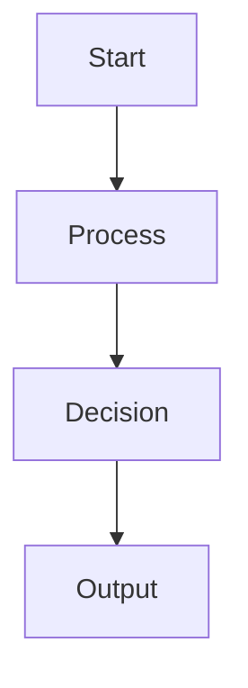

# Exercise 03: Prompt Templates

[← Previous: System Prompts](02_system_prompt.md) | [Index](README.md) | [Next: Vision →](04_vision.md)

## What You Learned

From the basic example, you learned:
- How to load and process template files
- Removing comment lines (///) for cleaner prompts
- Variable substitution using placeholders like [[.VarName]]
- Basic conditional logic in templates
- Separating prompt logic from application code
- Using timestamps and dynamic data in prompts

## Exercises

### Exercise 1: Create a Code Review Template (Beginner)

Create a template that generates code review prompts for different programming languages.

**Your template should:**
- Accept variables: [[.Language]], [[.CodeSnippet]], [[.ReviewFocus]]
- Include language-specific review criteria
- Remove comment lines starting with ///
- Support at least 3 languages (Python, JavaScript, Go)

**Template structure:**
```
/// Code Review Template
# Review [[.Language]] Code

Please review this [[.Language]] code:
```
[[.CodeSnippet]]
```

[[if .Language == "Python"]]
Focus on: PEP 8 compliance, type hints, docstrings
[[else if .Language == "JavaScript"]]
Focus on: ESLint rules, async/await usage, ES6+ features
[[end]]

Review focus: [[.ReviewFocus]]
```

### Exercise 2: Build a Recipe Generator Template (Intermediate)

Create a template system for generating cooking recipes based on cuisine type and dietary restrictions.

**Requirements:**
- Variables: [[.Cuisine]], [[.DietaryRestrictions]], [[.ServingSize]], [[.CookingTime]]
- Conditional sections for different cuisines
- Include measurement conversions
- Add nutritional guidelines based on dietary restrictions

**Challenge:** Implement nested conditionals for combining cuisine and dietary needs.

### Exercise 3: Dynamic Email Template System (Intermediate)

Build a template that generates different types of emails (welcome, newsletter, support).

**Features to implement:**
- Email type selection with conditionals
- Personalization variables: [[.FirstName]], [[.Company]], [[.Product]]
- Footer that changes based on email type
- Unsubscribe link generation

**Bonus:** Add A/B testing variants within the same template.

### Exercise 4: Markdown Formatting for Better AI Understanding (Intermediate)

Explore how markdown syntax helps LLMs parse and understand prompts more effectively.

**Part A - Structure Hierarchy Testing:**
Create templates that test how different heading levels affect AI comprehension:

```markdown
/// Test template for heading hierarchy
# Main Task: [[.Task]]

## Context
[[.Context]]

### Requirements
[[.Requirements]]

#### Detailed Specifications
[[.Specifications]]
```

**Experiment with:**
1. Create identical prompts with different heading structures
2. Test flat structure (all same level) vs hierarchical
3. Compare AI's ability to extract specific sections
4. Measure how heading depth affects response organization

**Part B - List Format Comparison:**
Build a template that uses different list formats for the same content:

```markdown
/// Compare list formatting impact
# Task Analysis for [[.Project]]

## Approach 1: Bullet Points
* First consideration
* Second consideration
  * Sub-point with detail
  * Another sub-point

## Approach 2: Numbered List
1. First consideration
2. Second consideration
   a. Sub-point with detail
   b. Another sub-point

## Approach 3: Mixed Format
1. **Main Point:** Description
   - Supporting detail
   - Additional context
2. **Second Point:** Description
   * Alternative notation
   * Further information
```

**Tasks:**
- Test which format produces more structured responses
- Analyze how numbering affects AI's reference to specific points
- Determine if indentation depth impacts understanding

**Part C - Code Block and Formatting Signals:**
Create a template that uses various markdown elements as semantic signals:

```markdown
/// Semantic markdown signals template
# Code Review Request

**Priority:** [[.Priority]]
**Language:** `[[.Language]]`

## Code to Review
```[[.Language]]
[[.CodeSnippet]]
```

### Key Areas (use formatting for emphasis)
- **Critical:** Security vulnerabilities
- *Important:* Performance optimizations
- `inline_code`: Variable naming conventions
- ~~deprecated~~ Old patterns to avoid
- ==highlight== Areas needing special attention

> Note: Pay special attention to the highlighted sections

### Expected Output Format
| Aspect | Status | Comments |
|--------|---------|-----------|
| Security | ✅/❌ | Details |
| Performance | ⚠️ | Suggestions |
```

**Evaluation criteria:**
1. Does bold text get higher priority in responses?
2. Do code blocks preserve formatting better than plain text?
3. How do blockquotes affect the AI's interpretation?
4. Does table format encourage structured responses?

### Exercise 5: Prompt Engineering with XML-like Tags (Advanced)

Design templates that use XML-style tags for better prompt structure:

**Part A - Custom Tag System:**
```markdown
/// XML-style structured prompt
# [[.TaskType]] Assistant

<context>
[[.Context]]
</context>

<instructions priority="high">
[[.MainInstructions]]
</instructions>

<constraints>
- [[.Constraint1]]
- [[.Constraint2]]
</constraints>

<examples>
<example type="positive">
[[.GoodExample]]
</example>
<example type="negative">
[[.BadExample]]
</example>
</examples>

<output-format>
[[.OutputSpec]]
</output-format>
```

**Part B - Nested Structure Testing:**
Create templates with deeply nested structures to test comprehension limits:

```markdown
<task>
  <phase name="analysis">
    <step order="1">
      <action>[[.Action1]]</action>
      <validation>[[.Check1]]</validation>
    </step>
    <step order="2">
      <action>[[.Action2]]</action>
      <validation>[[.Check2]]</validation>
    </step>
  </phase>
</task>
```

**Research tasks:**
1. Compare XML-style tags vs markdown headers for structure
2. Test if custom tags improve response adherence to format
3. Measure the impact of nesting depth on comprehension
4. Evaluate if tag attributes (priority="high") influence behavior

### Exercise 6: Format-Driven Response Control (Advanced)

Create templates that use formatting to control response characteristics:

**Part A - Response Length Control:**
```markdown
/// Length control through formatting
# Generate [[.ContentType]]

## Brief Summary (1-2 sentences)
> [[.TopicBrief]]

### Detailed Explanation (3-5 paragraphs)
[[.TopicDetail]]

#### Comprehensive Analysis (Full Response)
[[.TopicComprehensive]]
```

**Part B - Multi-Format Output Template:**
```markdown
/// Multi-format response template
# Data Analysis for [[.Dataset]]

## Response Formats Required:

### 1. Executive Summary
**Format:** Single paragraph, no technical details

### 2. Technical Report
```yaml
format: structured
sections:
  - methodology
  - findings
  - recommendations
detail_level: high
```

### 3. Visual Representation


### 4. Actionable Checklist
- [ ] Action item with checkbox
- [x] Completed item example
- [ ] **Priority:** High priority item
```

**Experiments to run:**
1. Test if format specifications in code blocks are followed more precisely
2. Compare YAML vs JSON vs plain text for configuration
3. Evaluate if mermaid diagrams prompt visual descriptions
4. Measure checkbox influence on action-oriented responses

**Bonus:** Add A/B testing variants within the same template.

### Exercise 7: Multi-Template Chaining (Advanced)

Create a system that chains multiple templates together to build complex prompts.

**Implementation:**
1. Create a "master" template that references other templates
2. Build a template loader that can include other template files
3. Support recursive template inclusion
4. Implement a template cache to avoid reloading

**Example use case:** A blog post generator that uses separate templates for intro, body paragraphs, and conclusion.

### Exercise 8: Template with Loops (Advanced)

Extend the template system to support loops for repetitive content.

**Add support for:**
```
[[range .Items]]
- Item: [[.Name]] - Price: [[.Price]]
[[end]]
```

**Challenge:** Implement this without using a full template engine, using only string manipulation.

### Exercise 9: Template Validation System (Advanced)

Build a validator that checks templates before compilation.

**Validation checks:**
- All variables used are defined
- Conditional blocks are properly closed
- No syntax errors in template markers
- Comments are properly formatted
- Required variables are present

**Output:** Detailed error report with line numbers and suggestions.

### Exercise 10: Template Performance Optimizer (Expert)

Create an optimized template compiler that pre-processes templates for faster execution.

**Optimizations to implement:**
1. **Pre-compilation:** Convert templates to an intermediate representation
2. **Variable extraction:** Index all variables for quick lookup
3. **Conditional pre-processing:** Build a decision tree for conditionals
4. **Caching:** Implement an LRU cache for compiled templates
5. **Benchmarking:** Compare performance with naive string replacement

**Goal:** Achieve 10x faster template processing for large templates.

## Real-World Applications

1. **Documentation Generator:** Use templates to create consistent API documentation
2. **Report Builder:** Generate business reports with dynamic data and charts
3. **Chatbot Responses:** Create personality-driven responses for different bot personas
4. **Contract Generator:** Build legal documents with variable terms and conditions
5. **Landing Page Creator:** Generate A/B test variants of marketing copy

## Reflection Questions

1. **Design Decision:** Why use custom delimiters like [[]] instead of standard {{}}? What conflicts might arise?

2. **Security Consideration:** What security risks exist when processing user-provided templates? How would you mitigate template injection attacks?

3. **Performance vs. Features:** How do you balance template feature richness with compilation speed? Where would you draw the line?

4. **Error Handling:** How should templates handle missing variables? Should they fail loudly or provide defaults?

5. **Template Inheritance:** How would you implement template inheritance (like Jinja2's extends) while keeping the system simple?

## Code References

- Basic implementation: `bash/03_prompt_template_minimal.sh`
- Full implementation: `bash/03_prompt_template_full.sh`
- Python version: `python/03_prompt_template.py` (lines 85-150 for template processing)
- Node.js version: `nodejs/03_prompt_template.js` (see TemplateProcessor class)
- Go version: `go/03_prompt_template.go` (using text/template package)

## Key Takeaways

- Templates separate prompt logic from application code
- Comment stripping keeps prompts clean and professional
- Variable substitution enables dynamic content generation
- Conditional logic allows context-aware prompts
- Template systems can range from simple string replacement to complex compilers
- Performance optimization becomes crucial at scale
- Security considerations are vital when processing user-provided templates

## Markdown Best Practices for Prompt Engineering

Understanding how LLMs interpret markdown formatting can significantly improve prompt effectiveness:

### Structural Hierarchy
- **Headings (#, ##, ###)**: Create clear information hierarchy that helps LLMs understand importance and relationships
- **Depth matters**: Use no more than 4 heading levels; deeper nesting can confuse the model
- **Consistency**: Maintain consistent heading structure throughout your prompts

### Emphasis and Priority
- **Bold text (****text****)**: Signals high importance or key concepts the AI should focus on
- **Italics (*text*)**: Indicates secondary emphasis or examples
- **Code formatting (`code`)**: Preserves exact formatting and signals technical content
- **Strikethrough (~~text~~)**: Effectively communicates what NOT to do

### List Formatting Impact
- **Numbered lists**: Best for sequential steps or ranked priorities
- **Bullet points**: Ideal for unordered collections or parallel concepts
- **Nested lists**: Show relationships but limit to 2-3 levels deep
- **Checkboxes**: Great for action items and task tracking

### Advanced Formatting Techniques
- **Tables**: Excellent for structured data comparison and forcing structured responses
- **Blockquotes (>)**: Useful for context, notes, or examples that shouldn't be primary focus
- **Code blocks with language hints**: Help AI understand context and maintain syntax
- **Horizontal rules (---)**: Create clear visual and logical separations

### XML-Style Tags
- **Custom tags**: `<context>`, `<instructions>`, `<constraints>` provide semantic structure
- **Attributes**: Tags with attributes like `priority="high"` can influence AI behavior
- **Closing tags**: Always close custom tags to maintain structure integrity

### Format-Driven Behaviors
- **Length control**: Heading depth often correlates with expected response detail
- **Response format**: Using specific markdown in prompts often triggers similar formatting in responses
- **Multi-format requests**: Combining different formats can generate varied response styles

### Common Pitfalls to Avoid
- Over-nesting structures (>4 levels deep)
- Mixing incompatible formatting styles
- Using markdown that conflicts with your template delimiters
- Assuming all LLMs interpret markdown identically
- Forgetting that some markdown features (like mermaid diagrams) are display-only

[← Previous: System Prompts](02_system_prompt.md) | [Index](README.md) | [Next: Vision →](04_vision.md)